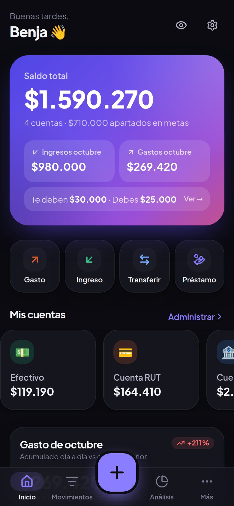
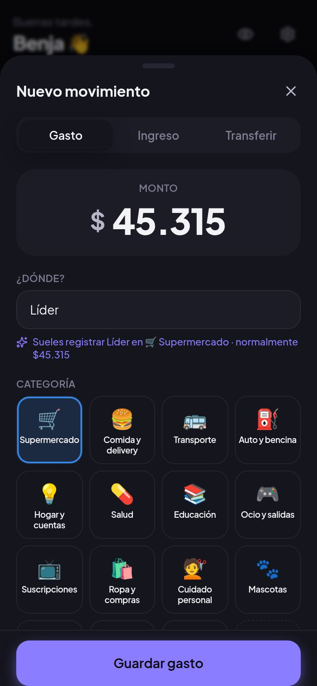
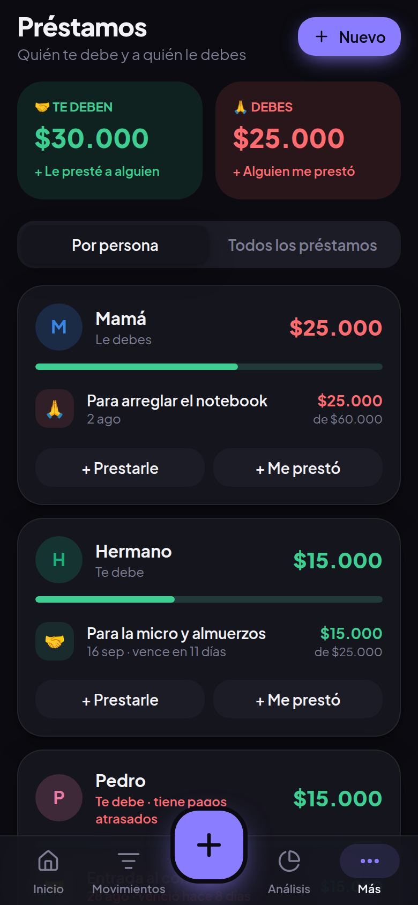
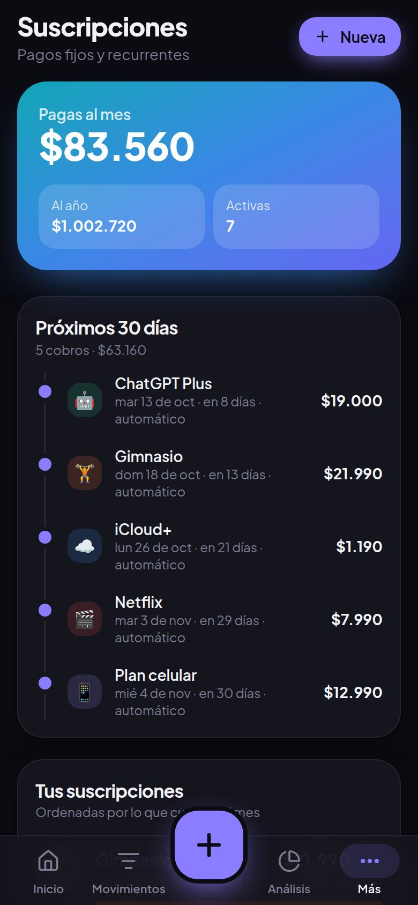

# 💸 Mis Finanzas

### 👉 [Abrir la app: benjaavmm.github.io/Appfinanzas](https://benjaavmm.github.io/Appfinanzas/)

> Para instalarla en el celular, abre **ese link** (no esta página de GitHub) y desde ahí usa "Instalar app".

App personal para ordenar tu dinero: **cuánto tienes, en qué gastas, quién te debe, cuánto pagas en suscripciones** y un asistente que aprende de tus gastos para avisarte a tiempo.

Está pensada primero para el **celular** (se instala como app y funciona sin internet), pero también se ve bien en el computador.

  
  
  
  

## Qué puedes hacer

|                        |                                                                                                                                                                                                                                                                     |
| ---------------------- | ------------------------------------------------------------------------------------------------------------------------------------------------------------------------------------------------------------------------------------------------------------------- |
| 🏦 **Cuentas**         | Efectivo, Cuenta RUT, cuenta corriente, tarjeta de crédito, ahorro… Cada una con su saldo, más el saldo total y tu patrimonio neto.                                                                                                                                 |
| 💸 **Movimientos**     | Gastos, ingresos y transferencias con monto, lugar, categoría, cuenta, fecha, hora y nota. Búsqueda, filtros por mes/categoría/cuenta y "Deshacer" al borrar.                                                                                                       |
| ✨ **Aprende de ti**   | Al escribir "Líder" ya sabe que es Supermercado, con qué cuenta pagas y cuánto gastas normalmente. Tus gastos frecuentes aparecen como atajos de un toque.                                                                                                          |
| 🤝 **Préstamos**       | "Le presté $20.000 a mi hermano": quién te debe, a quién le debes, abonos parciales, fecha límite, alertas de atraso y un botón para mandar un recordatorio por WhatsApp.                                                                                           |
| 🔁 **Suscripciones**   | Netflix, Spotify, gimnasio, plan del celular… Cuánto pagas al mes y al año, calendario de próximos cobros y registro automático del gasto cuando se cobra.                                                                                                          |
| 🎯 **Presupuestos**    | Límite mensual total y por categoría, con "cuánto puedes gastar por día" y avisos al llegar al 80% y 100%. Te sugiere montos según tu promedio.                                                                                                                     |
| 🐷 **Metas de ahorro** | Viaje, notebook, fondo de emergencia: progreso y cuánto apartar al mes para llegar a la fecha.                                                                                                                                                                      |
| 📊 **Análisis**        | Comparación con el mes pasado a la misma altura, proyección de fin de mes, gasto por categoría, calendario de gastos, días de la semana en que más gastas, ranking de lugares, gastos hormiga y un puntaje de salud financiera (0–100) que explica cómo se calcula. |
| ✨ **Asistente**       | Un chat donde preguntas "¿cómo voy este mes?", "¿cuánto gasté en comida en agosto?", "¿quién me debe?", "¿cuánto tengo que pagar de la tarjeta?" o "¿cuánto puedo gastar por día?", con texto o con la voz, y responde con tus datos. Entiende preguntas de seguimiento ("¿y el mes pasado?") y si le dices "gasté 5 lucas en uber" te ayuda a anotarlo. Funciona sin internet y no envía nada a ningún servidor. |
| 🔒 **Privacidad**      | Tus datos se guardan **en tu dispositivo** (y en la nube solo si activas tu cuenta, ver más abajo). Modo "ocultar montos", bloqueo con PIN, respaldo/restauración en un archivo y exportación a Excel (CSV).                                                                                                           |
| 🌗 **Diseño**          | Modo claro/oscuro automático, animaciones, hojas deslizables tipo app nativa, vibración al guardar (Android).                                                                                                                                                       |

## ¿Local o en la nube? ¿Cuánto cuesta?

**$0, para siempre.** La app no necesita servidor: es una página web que se guarda en tu teléfono (PWA) y guarda los datos ahí mismo. Por eso:

- **No usa tus créditos de la nube.** El entorno en la nube de Claude Code solo se usó para _programarla_; la app no corre ahí.
- Se publica gratis en **GitHub Pages** (el repositorio es público, así que no tiene costo).
- Una vez abierta la primera vez, **funciona sin internet**.

> ⚠️ Como los datos viven en tu teléfono, si borras los datos del navegador o cambias de teléfono, se pierden. Usa **Ajustes → Descargar respaldo** de vez en cuando (y "Restaurar respaldo" en el teléfono nuevo).

## Instalarla en el celular

- **Android (Chrome):** abre **https://benjaavmm.github.io/Appfinanzas/** → menú **⋮** → **Instalar app** (o "Agregar a la pantalla principal"). Si lo haces desde la página de GitHub, Chrome intentará instalar GitHub y dirá que no se puede. También aparece un botón en **Ajustes → Instalar en tu teléfono**.
- **iPhone (Safari):** abre el link → botón **Compartir** → **Agregar a inicio**.

Queda con su ícono, se abre a pantalla completa y se actualiza sola cuando hay una versión nueva.

Para probar todo sin escribir datos, en la pantalla de bienvenida toca **"Explorar con datos de ejemplo"** (o en Ajustes → Cargar datos de ejemplo).

## Cuenta, respaldo en la nube y amigos (Supabase, opcional)

Con una cuenta puedes iniciar sesión, tener tus datos en varios dispositivos y **compartir préstamos con amigos**. Por ejemplo, si Benjamín anota que le prestó $10.000 a Karim, a Karim le aparece "Le debes $10.000 a Benjamín" con recordatorio en la fecha de pago y un botón **"Ya le pagué"**, y Benjamín lo confirma. Supabase tiene un plan gratis que alcanza de sobra para uso personal.

Sin estos pasos la app funciona igual que siempre, solo en el dispositivo.

1. Crea un proyecto gratis en **https://supabase.com** (elige la región São Paulo, que es la más cercana).
2. En **SQL Editor → New query**, pega todo el archivo [`supabase/schema.sql`](supabase/schema.sql) y toca **Run**. Crea las tablas y las reglas de seguridad; se puede volver a correr sin problema.
3. En **Authentication → URL Configuration**:
   - **Site URL:** `https://benjaavmm.github.io/Appfinanzas/`
   - **Redirect URLs:** agrega `https://benjaavmm.github.io/Appfinanzas/**`
4. En **Project Settings → API**, copia la **Project URL** y la clave **anon public**. Esa clave se puede publicar: la protección la dan las reglas del paso 2.
5. En GitHub, en el repo, ve a **Settings → Secrets and variables → Actions → pestaña Variables → New repository variable** y crea:
   - `SUPABASE_URL` = la Project URL
   - `SUPABASE_ANON_KEY` = la clave anon public
   - (opcional) `SUPABASE_GOOGLE` = `1`, si activaste Google en **Authentication → Providers**
6. En **Actions**, abre el último "Deploy" y elige **Re-run all jobs**, o sube cualquier cambio. Al terminar, en la app aparecen **Más → Mi cuenta** y **Más → Amigos**.

Qué se guarda en la nube: tus datos de la app, para el respaldo. No se guardan las fotos de boletas ni el PIN, que se quedan en el teléfono. Para los amigos solo se comparte tu nombre, tu @usuario y los préstamos entre ustedes. Nadie puede ver los datos de otra persona.

> 🔐 **Sobre la seguridad.** Los datos que se respaldan en la nube se guardan **sin cifrar** en tu proyecto de Supabase (solo tú y quien administre ese proyecto pueden leerlos). El PIN es un bloqueo de privacidad casual: protege de quien mire tu pantalla, pero **no cifra** los datos del dispositivo. Tras 5 intentos fallidos la app te hace esperar antes de probar otra vez.
>
> **Si ya tenías Supabase configurado, vuelve a pegar y ejecutar [`supabase/schema.sql`](supabase/schema.sql)** en el SQL Editor (es seguro repetirlo). La última versión impide que quien recibe una solicitud de amistad modifique quién la envió.

## Asistente con IA (Claude, opcional)

El asistente del chat responde sin internet las preguntas que conoce. Si activas la IA, las preguntas difíciles, los "¿por qué?" y los consejos los responde **Claude** con tus datos. Se envía tu pregunta y un resumen de tus finanzas a tu Supabase, y de ahí a Anthropic. Necesitas tener la cuenta en la nube funcionando (sección anterior).

1. **Clave de Anthropic:** en https://console.anthropic.com crea una cuenta. En **Billing** carga crédito (el mínimo alcanza para mucho) y en **API Keys** crea una clave (empieza con `sk-ant-`). Es secreta: no la pongas en GitHub.
2. **Base de datos:** en Supabase → **SQL Editor**, vuelve a correr todo [`supabase/schema.sql`](supabase/schema.sql). Agrega el límite diario de preguntas.
3. **Función:** en Supabase → **Edge Functions → Deploy a new function → Via Editor**. Nómbrala `asistente`, pega todo el archivo [`supabase/functions/asistente/index.ts`](supabase/functions/asistente/index.ts) y toca **Deploy**.
4. **Secreto:** en **Edge Functions → Secrets**, agrega `ANTHROPIC_API_KEY` con tu clave.
5. **En la app:** abre **Asistente**, toca la carita de arriba y en **Inteligencia artificial** elige **Cuando haga falta** o **Siempre**.

Opcional, también en **Secrets**:
- `ASSISTANT_MODEL`: modelo a usar. Por defecto es `claude-opus-5-5`. Para gastar menos puedes poner `claude-sonnet-5-5` o `claude-haiku-4-5`.
- `ASSISTANT_DAILY_LIMIT`: preguntas por persona al día. Por defecto son 60.

## Cómo está hecha

- **React 19 + TypeScript + Vite**, estilos con **Tailwind CSS 4**, animaciones con **Motion**, gráficos con **Recharts**.
- **Zustand** para el estado, guardado en **IndexedDB** (con respaldo en localStorage).
- **vite-plugin-pwa** para que se instale y funcione sin conexión.

